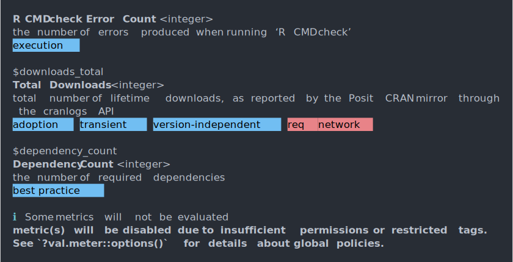
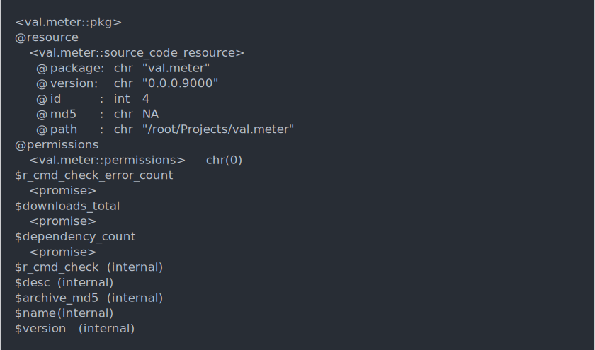

<!-- README.md is generated from README.Rmd. Please edit that file -->

# `val.meter`

*validation-ready package quantification supporting regulatory use of R*

<!-- badges: start -->

<!-- badges: end -->

## Installation

``` r
# install.packages("pak")
pak::pak("pharmaR/val.meter")
```

## Overview

Easily measure characteristics of packages, built to support the process
of *validation* required in regulated industries, but generally useful
to anyone who wants to survey packages.

``` r
rpkg <- random_pkg(permissions = TRUE)
metrics(rpkg)
```

<picture>
<source media="(prefers-color-scheme: dark)" srcset="man/figures/README/overview-metrics-dark.svg">

</picture>

## Features

### Exploring metrics

`val.meter` makes it easy to find a listing of metrics and details of
what those metrics represent.

``` r
metrics()
```

<picture>
<source media="(prefers-color-scheme: dark)" srcset="man/figures/README/metrics-dark.svg">
 </picture>

`metrics` actually represent a small set of the internally calculated
package data, which may go through a few stages of calculation before
resulting in a quantifiable metric. If you want to see *all* the
internal information, you can explore the whole set of package data.

`metrics` are unique in that their data is required to be consistent and
simple (atomic) data.

``` r
# see all implemented _data_ (a superset of metrics)
metrics(all = TRUE)
```

<picture>
<source media="(prefers-color-scheme: dark)" srcset="man/figures/README/metrics-all-dark.svg">
 </picture>

### Creating package objects

To start evaluating metrics, start by create a `pkg` (package) object.
Package objects represent a set of resources from which metadata is
pulled and a collection of package metadata. When we pass a `character`
path or package name, `val.meter` will search for the package from
permitted sources.

``` r
# calculate some data, using default conservative permissions
pkg("../val.meter")
```

<picture>
<source media="(prefers-color-scheme: dark)" srcset="man/figures/README/pkg-dark.svg">
 </picture>

We can also be declarative about exactly how we want to source our
package metadata.

``` r
library(S7)

# initialize package with only our installed package as a resource
resrc <- convert("../val.meter", source_code_resource)
pkg(resrc)
```

<picture>
<source media="(prefers-color-scheme: dark)" srcset="man/figures/README/pkg-explicit-dark.svg">

</picture>

#### Calculating metrics

Once we have declared *what* we want to assess, we can then start
calculating metrics.

``` r
p <- pkg("../val.meter")
metrics(p)
```

<picture>
<source media="(prefers-color-scheme: dark)" srcset="man/figures/README/metrics-from-pkg-dark.svg">

</picture>

In this case, you’ll notice that some metric calculations raised errors
during execution. Here you’ll notice that we have not granted
`val.meter` permission to execute code or fetch data from APIs over the
network.

We can also access individual metrics by accessing our `pkg` object like
a list.

``` r
p$dependency_count
```

<picture>
<source media="(prefers-color-scheme: dark)" srcset="man/figures/README/metric-dep-count-dark.svg">

</picture>

Packages are *lazy* :zzz:! Since some metrics can be computationally
intensive, we only calculate them as their needed. After they’re
calculated the first time, the result is saved so you can access it
whenever you need it.

#### Managing execution permissions

We can opt-in to more extensive capabilities by giving our package more
permissive execution. We pass `permissions(TRUE)` to grant blanket
permission to all capabilities.

``` r
p <- pkg("../val.meter", permissions = "network")
metrics(p)
```

<picture>
<source media="(prefers-color-scheme: dark)" srcset="man/figures/README/metrics-permissive-dark.svg">

</picture>

And digging a bit deeper, we’ll see that `r_cmd_check` itself requires
additional permissions to grant `val.meter` the ability to execute code
on your machine.

``` r
p$r_cmd_check
```

<picture>
<source media="(prefers-color-scheme: dark)" srcset="man/figures/README/metric-r-cmd-check-error-dark.svg">

</picture>
